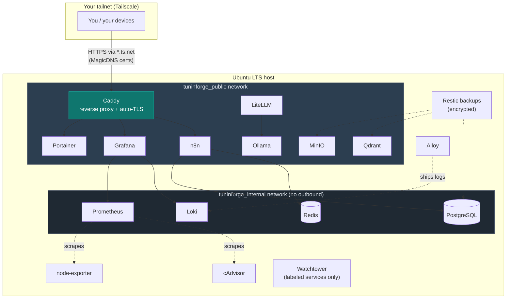

<div align="center">

# tuninforge

**One command turns a fresh Ubuntu server into a private, production-grade, self-hosted stack.**

Pick your services from a menu — get Tailscale-fronted access, automatic TLS, encrypted backups, and full observability, with **nothing exposed to the public internet.**

[](LICENSE)
[](#)
[](CONTRIBUTING.md)
[](https://github.com/coderhisham/tuninforge/issues)
[](https://github.com/coderhisham/tuninforge/stargazers)

[Getting Started](#getting-started) · [Services](#what-you-get) · [Architecture](#architecture) · [Contributing](#contributing) · [Community](#community-and-support)

</div>

---

tuninforge is an **open-source, community-driven** homelab bootstrapper. It's
deliberately modular: every service is a self-contained folder, the whole
catalog is one registry file, and adding a new service is a single pull request.
If you can write a `docker-compose.yml`, you can extend it — see
**[Contributing](#contributing)**.

## What you get

| Layer | Services |
|---|---|
| **Access** | Tailscale (mesh VPN), SSH hardening (lockout-safe) |
| **Core** | Docker + Compose (auto-installed), Caddy (reverse proxy + auto-TLS), Portainer, Watchtower |
| **Data** | PostgreSQL (multi-db), Redis, MinIO (S3), Qdrant (vectors) |
| **AI** | Ollama (local LLMs), LiteLLM (OpenAI-compatible gateway) |
| **Automation** | n8n (workflows) |
| **Observability** | Prometheus + node-exporter + cAdvisor, Loki, Alloy, Grafana |
| **Backup** | Restic (encrypted, local + remote repos) |

Every service is **individually selectable**. Core (Caddy + Portainer) is
pre-selected; heavy services (MinIO, Qdrant, Ollama) are opt-in. Dependencies
resolve automatically — pick n8n and it pulls in Postgres + Redis.

## Getting Started

From a bare server to a running private stack in ~20 minutes. No prior
experience with these tools assumed.

### Prerequisites

1. **A fresh Ubuntu LTS server** (24.04 or 22.04) with a `sudo` user. A VPS, a
   spare box, or a VM all work.
2. **A [Tailscale](https://tailscale.com) account** (free tier is plenty) —
   how you'll reach services privately, with no open ports.
3. **A working SSH key login** to the server (`ssh you@server` with no password
   prompt). If not yet: `ssh-copy-id you@server` from your laptop first.

> [!WARNING]
> **Try it on a disposable/snapshot VM the first time.** The access layer
> changes SSH and firewall settings; a mistake on a box you can't console into
> could lock you out. Snapshot first, or learn the flow on a throwaway VM.

### 1. Enable Tailscale HTTPS (one-time, in the browser)

In the [Tailscale admin console](https://login.tailscale.com/admin/dns) → **DNS**,
turn on **MagicDNS** and click **Enable HTTPS**. This lets Caddy issue real TLS
certs for your `*.ts.net` names.

### 2. Clone and run

```bash
git clone https://github.com/coderhisham/tuninforge.git
cd tuninforge
./tuninforge.sh install
```

You get an interactive menu: choose **QuickStart** (sensible core) or
**Advanced** (pick every service). It shows exactly what will install and an
estimated RAM/disk footprint, and asks before touching anything.

> [!IMPORTANT]
> Generated secrets are printed **once**, in a red box. Save them to a password
> manager immediately — they live only in git-ignored `.env` files and are never
> shown again. See [Configuration and secrets](#configuration-and-secrets).

### 3. Reach your services

```bash
./tuninforge.sh status     # what's installed + each service's health
tailscale ip -4            # your server's private address
```

From any device on your tailnet, browse to your server's MagicDNS name
(`https://your-host.your-tailnet.ts.net`). Add more anytime:
`./tuninforge.sh add <service>`.

## Commands

```bash
./tuninforge.sh install [--with a,b,c] [--config FILE] [--dry-run] [--yes]
./tuninforge.sh add <service>...                  # add to a running stack
./tuninforge.sh remove <service>... [--dry-run] [--purge-volumes]
./tuninforge.sh status                            # installed vs available + health
./tuninforge.sh --help
```

Every command supports `--dry-run` — it prints exactly what it *would* do and
changes nothing. Backup / restore:

```bash
sudo ./scripts/backup.sh                    # encrypted; local repo by default
sudo ./scripts/restore.sh [--list|<id>]     # destructive; typed confirmation
sudo ./scripts/uninstall.sh [--purge-volumes]
```

## Architecture



Two Docker networks: **`tuninforge_public`** for Caddy-fronted services, and an
internal **`tuninforge_internal`** (no gateway/outbound) that isolates the data
layer. No service publishes ports to the host — everything is reached through
Caddy over your tailnet.

## Configuration and secrets

You don't need to hand-edit anything to get started — the installer generates
everything. Each service has `modules/<service>/.env.example` (committed, safe
defaults) and a generated, git-ignored `modules/<service>/.env` (mode `600`).
Secret placeholders like `POSTGRES_PASSWORD=__GEN:alnum:40__` become strong
random values on first install, shown once. **Re-running never rotates an
existing secret.**

For repeatable/non-interactive installs, copy `tuninforge.config.example.yaml`
to `tuninforge.config.yaml` (git-ignored) and pass `--config`, or just use
`--with a,b,c`.

## Design principles

- **Safety first.** Nothing touches the system without a confirmation gate. SSH
  hardening is lockout-safe: it verifies key login, writes a drop-in that wins
  over cloud-init defaults, validates the *effective* config with `sshd -T`,
  reloads (never restarts), and makes you confirm a fresh session — with a
  printed rollback if it isn't.
- **Private by default.** Reached over Tailscale; Caddy gets real TLS certs for
  your `*.ts.net` name with no open ports and no public domain.
- **Idempotent.** Running the installer twice never breaks an existing setup.
- **Modular & registry-driven.** One `lib/deps.sh` registry powers selection,
  dependencies, install order, status, and teardown — so a new service is one
  row + a folder.
- **Stateful data is protected.** Watchtower auto-updates only labeled,
  stateless services; databases are pinned for manual, backed-up updates.

## Contributing

**tuninforge is built to be extended by the community — contributions are the
whole point.** Adding a service is deliberately small: one registry row in
`lib/deps.sh` plus a `modules/<name>/` folder with a `docker-compose.yml`,
`.env.example`, and `healthcheck.sh`.

Good first contributions:

- **Add a service** you self-host (a new database, app, or exporter).
- **Improve a module** — pin a better image, tighten a healthcheck, add GPU support.
- **Docs** — clarify a setup step, fix a failure-mode table, improve this README.
- **Report or fix bugs** you hit on your own hardware.

Start with **[CONTRIBUTING.md](CONTRIBUTING.md)** — it has the full module
convention, coding standards, and a pre-PR checklist. Then:

1. Fork the repo and create a branch.
2. Build your change; test it on a disposable VM (`--dry-run` first).
3. Open a PR describing what you tested and on what.

New contributors are welcome regardless of experience level — if something is
unclear, open an issue and ask.

## Community and support

- **[Discussions](https://github.com/coderhisham/tuninforge/discussions)** —
  questions, ideas, show-and-tell, help with your setup.
- **[Issues](https://github.com/coderhisham/tuninforge/issues)** — bugs and
  feature requests.
- **[Per-service docs](docs/)** — every service has a page covering what it
  does, how to verify it, common failure modes, and backup/restore.

## Roadmap

Tracked in [Issues](https://github.com/coderhisham/tuninforge/issues) and
[Discussions](https://github.com/coderhisham/tuninforge/discussions). Community
priorities welcome — some directions:

- More selectable services (community-contributed modules).
- A maintained S3 engine to succeed MinIO CE (see [docs/minio.md](docs/minio.md)).
- Optional public-domain TLS path alongside the Tailscale default.
- Per-service Prometheus exporters wired into the observability layer.

## Requirements

- A fresh **Ubuntu LTS** server (22.04 / 24.04) with a `sudo` user.
- A [Tailscale](https://tailscale.com) account with MagicDNS + HTTPS enabled.
- A working SSH key login (before SSH hardening). Docker is auto-installed.

## License

[AGPL-3.0](LICENSE). By contributing, you agree your work is licensed under it.

<div align="center">
<sub>Built for the self-hosting community. Star it if it's useful, and send a PR to make it better.</sub>
</div>
