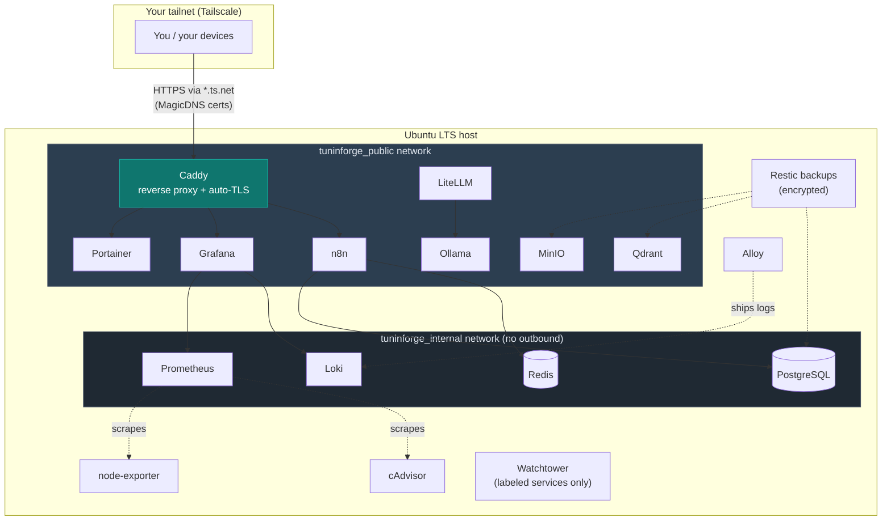

# tuninforge

A CLI-driven installer that stands up a production-grade, modular, self-hosted
developer infrastructure stack on a fresh Ubuntu LTS server. Clone, run one
command, pick your services from a menu, and get a Tailscale-fronted stack with
automatic TLS, encrypted backups, and observability — **nothing exposed to the
public internet.**

New here? Jump to **[Getting Started](#getting-started)** for a step-by-step walkthrough.

## What you get

| Layer | Services |
|---|---|
| **Access** | Tailscale (mesh VPN), SSH hardening (lockout-safe) |
| **Core** | Docker + Compose (auto-installed), Caddy (reverse proxy + auto-TLS), Portainer, Watchtower |
| **Data** | PostgreSQL (multi-db), Redis, MinIO (S3), Qdrant (vectors) |
| **AI** | Ollama (local LLMs), LiteLLM (OpenAI-compatible gateway) |
| **Automation** | n8n (workflows) |
| **Observability** | Prometheus + node-exporter + cAdvisor, Loki, Alloy, Grafana |
| **Backup** | Restic (encrypted, local + remote repos) |

Every service is individually selectable. Core (Caddy + Portainer) is
pre-selected; heavy services (MinIO, Qdrant, Ollama) are opt-in.

---

## Getting Started

This walkthrough takes you from a bare server to a running, private stack.
**Budget ~20 minutes.** No prior experience with these tools is assumed.

### Step 0 — What you need first

1. **A fresh Ubuntu LTS server** (24.04 or 22.04). A cheap VPS, a spare box, or
   a VM all work. You need a user with `sudo`.
2. **A Tailscale account** — [free tier](https://tailscale.com) is plenty. This
   is how you'll reach your services privately, with no open ports. Sign up now;
   you'll authenticate the server in Step 2.
3. **An SSH key** already working to log into the server (i.e. you can
   `ssh you@server` without typing a password). If not, run `ssh-copy-id
   you@server` from your laptop first — the SSH-hardening step depends on it.

> [!WARNING]
> **Try this on a disposable/snapshot VM the first time.** The access layer
> changes SSH and firewall settings; a mistake on a box you can't console into
> could lock you out. Snapshot first, or use a throwaway VM to learn the flow.

### Step 1 — Enable Tailscale HTTPS (one-time, in the browser)

So Caddy can get real TLS certificates for your services, enable two things in
the [Tailscale admin console](https://login.tailscale.com/admin/dns) → **DNS**:

- **MagicDNS** — toggle on.
- **HTTPS Certificates** — click "Enable HTTPS".

(You only do this once per tailnet. Skip it and services still run, but without
HTTPS certs.)

### Step 2 — Clone and run the installer

On the server:

```bash
git clone https://github.com/coderhisham/tuninforge.git tuninforge
cd tuninforge
./tuninforge.sh install
```

You'll get an interactive menu:

1. **Setup mode** — pick **QuickStart** (installs the sensible core: Caddy +
   Portainer) or **Advanced** (choose every service, grouped by layer).
2. If Advanced, **check the services you want** with `space`, `enter` to
   continue. Dependencies are added automatically (pick n8n and it pulls in
   Postgres + Redis, telling you why).
3. **Review screen** — shows exactly what will install and an estimated
   RAM/disk footprint. Nothing has touched your system yet. Confirm to proceed.

The installer then, in order: sets up the access layer (Tailscale + optional SSH
hardening), installs Docker if missing, creates the networks, generates secrets,
and brings up each service — waiting for each to report healthy.

> [!IMPORTANT]
> When the installer generates secrets, it prints them **once**, in a red box.
> Save them to a password manager right then — they're stored only in
> git-ignored `.env` files and are never shown again. See
> [Configuration and secrets](#configuration-and-secrets) below.

### Step 3 — Reach your services

Services aren't exposed on public ports — you reach them over your tailnet.
After install:

```bash
tailscale status          # confirms your server is on the tailnet
tailscale ip -4           # your server's 100.x.y.z address
./tuninforge.sh status         # what's installed + each service's health
```

From any device signed into your tailnet, browse to your server's MagicDNS name
(e.g. `https://your-host.your-tailnet.ts.net`). Caddy serves it with a valid
certificate. As you add web services, they appear at subdomains Caddy fronts.

**That's it — you have a private, self-hosted stack.** Add more anytime with
`./tuninforge.sh add <service>`.

---

## Configuration and secrets

You do **not** need to hand-edit anything to get started — the installer
generates everything. This section is for when you want to customize.

### Per-service `.env` files (auto-generated)

Each service has `modules/<service>/.env.example` (committed, safe defaults) and,
after install, a `modules/<service>/.env` (generated, **git-ignored**, `chmod
600`). Secrets are created automatically: an entry like

```ini
POSTGRES_PASSWORD=__GEN:alnum:40__      # in .env.example
```

becomes a strong random value in the real `.env` on first install, shown once.
**Re-running the installer never rotates an existing secret** — your credentials
are stable. To change one, edit the service's `.env` and re-deploy it
(`./tuninforge.sh add <service>`).

Some values you may want to set yourself (all optional):

| Where | Key | What it does |
|---|---|---|
| `modules/caddy/.env` | `TUNINFORGE_TS_HOSTNAME` | Your `*.ts.net` name (auto-detected from Tailscale; override if needed). |
| `modules/grafana/.env` | `GRAFANA_ROOT_URL` | Public Grafana URL behind Caddy, for correct links. |
| `modules/postgres/.env` | `POSTGRES_MULTIPLE_DATABASES` | Comma-separated extra DBs to create on first boot. |
| `modules/litellm/.env` | `OPENAI_API_KEY`, `GEMINI_API_KEY` | External provider keys (only if you use them in `config.yaml`). |

### `tuninforge.config.yaml` (optional, for repeatable installs)

For a non-interactive or reproducible setup, copy the example and edit it:

```bash
cp tuninforge.config.example.yaml tuninforge.config.yaml   # git-ignored
# edit: which services, Tailscale auth key, SSH mode, backup repo, etc.
./tuninforge.sh install --config tuninforge.config.yaml
```

Or skip the file entirely and just name services:

```bash
./tuninforge.sh install --with caddy,portainer,postgres,redis
```

> [!CAUTION]
> `tuninforge.config.yaml` can hold a Tailscale auth key and other secrets — it's
> git-ignored for that reason. Never commit it. `.env` files are ignored too.

---

## Architecture



Two Docker networks: **`tuninforge_public`** for Caddy-fronted services, and an
internal **`tuninforge_internal`** (no gateway/outbound) that isolates the data layer
so it's reachable only by services that need it. No service publishes ports to
the host — everything is reached through Caddy over your tailnet.

## Command reference

```bash
./tuninforge.sh install [--with a,b,c] [--config FILE] [--dry-run] [--yes]
./tuninforge.sh add <service>...                     # add to a running stack
./tuninforge.sh remove <service>... [--dry-run] [--purge-volumes]
./tuninforge.sh status                               # installed vs available + health
./tuninforge.sh --help
```

Every command supports `--dry-run` — it prints exactly what it *would* do and
changes nothing. Use it freely to preview.

Backup / restore:

```bash
sudo ./scripts/backup.sh                    # encrypted; local repo by default
sudo ./scripts/restore.sh [--list|<id>]     # destructive; typed confirmation
sudo ./scripts/uninstall.sh [--purge-volumes]   # tear down the stack (keeps access layer)
```

See [docs/backup.md](docs/backup.md) for redirecting backups to S3/Backblaze/SFTP.

## Design principles

- **Safety first.** Nothing touches the system without a confirmation gate. The
  access layer installs first so the box is reachable before anything else. SSH
  hardening is lockout-safe: it verifies key login works, writes to a drop-in
  that wins over cloud-init defaults, validates the *effective* config with
  `sshd -T`, reloads (never restarts), and makes you confirm a fresh session
  before it's done — with a printed rollback if it isn't.
- **Private by default.** Services are reached over Tailscale; Caddy gets real
  TLS certs for your `*.ts.net` MagicDNS name with no open ports and no public
  domain.
- **Idempotent.** Running the installer twice never breaks an existing setup;
  secrets are never rotated on re-run.
- **Modular.** Each service is a self-contained `modules/<service>/` directory.
  A single registry (`lib/deps.sh`) drives selection, dependencies, install
  order, status, and teardown.
- **Secrets stay secret.** Strong secrets auto-generate into git-ignored `.env`
  files (0600) and print to your terminal exactly once.
- **Stateful data is protected.** Watchtower auto-updates only labeled,
  stateless services; databases and stores are pinned for manual, backed-up
  updates.

## Per-service documentation

Every service has a doc covering what it does, how to verify it, common failure
modes, and backup/restore — see [docs/](docs/). Start with
[tailscale](docs/tailscale.md) and [ssh-hardening](docs/ssh-hardening.md) (the
access layer), then [caddy](docs/caddy.md), [postgres](docs/postgres.md),
[n8n](docs/n8n.md), [grafana](docs/grafana.md), and [backup](docs/backup.md).

> **Upgrading PostgreSQL across major versions** (e.g. 16 → 18) requires a
> dump/restore migration — it won't boot on an old data directory. Steps are in
> [docs/postgres.md](docs/postgres.md).

## Requirements

- A fresh **Ubuntu LTS** server (22.04 / 24.04) with a `sudo` user.
- A [Tailscale](https://tailscale.com) account (free tier is fine), with
  MagicDNS + HTTPS certificates enabled (Step 1 above).
- A working SSH key login to the server (needed before SSH hardening).
- Docker is installed automatically if absent.

## Troubleshooting

| Symptom | Fix |
|---|---|
| A service shows unhealthy right after install | Give it a moment — some take 30–60s to start; `./tuninforge.sh status` re-checks. Then `./modules/<svc>/healthcheck.sh`. |
| `image ... not found` on pull | A pinned tag is stale for your arch; check the `image:` line in that module's `docker-compose.yml`. |
| Can't reach a service in the browser | Confirm `tailscale status` is up on both server and client, and that MagicDNS + HTTPS are enabled (Step 1). |
| SSH hardening won't proceed | You need a working key login first: `ssh-copy-id you@server`, verify passwordless login, then re-run. |
| Deep-dive a service | Each has a doc in [docs/](docs/) with its own failure modes. |

## License & contributing

[AGPL-3.0](LICENSE). Contributions welcome — see [CONTRIBUTING.md](CONTRIBUTING.md)
for the module convention (adding a service is one registry row + a
`modules/<name>/` directory).
