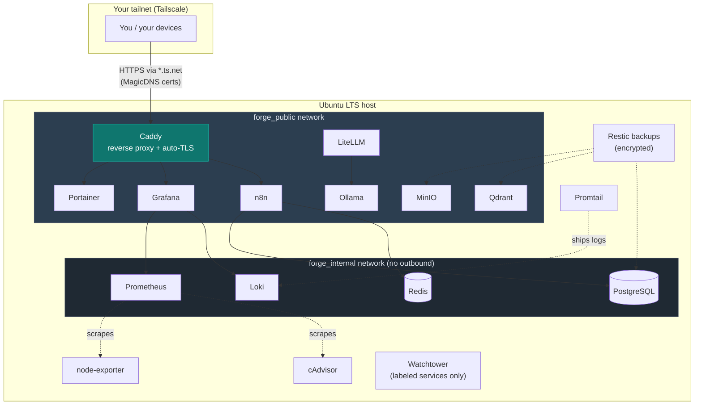

# homelab-forge

A CLI-driven installer that stands up a production-grade, modular, self-hosted
developer infrastructure stack on a fresh Ubuntu LTS server. Clone, run one
command, pick your services from a menu, and get a Tailscale-fronted stack with
automatic TLS, encrypted backups, and observability — nothing exposed to the
public internet.

```bash
git clone https://github.com/coderhisham/homeforge-lab.git homelab-forge
cd homelab-forge
./forge.sh install
```

## What you get

| Layer | Services |
|---|---|
| **Access** | Tailscale (mesh VPN), SSH hardening (lockout-safe) |
| **Core** | Docker + Compose (auto-installed), Caddy (reverse proxy + auto-TLS), Portainer, Watchtower |
| **Data** | PostgreSQL (multi-db), Redis, MinIO (S3), Qdrant (vectors) |
| **AI** | Ollama (local LLMs), LiteLLM (OpenAI-compatible gateway) |
| **Automation** | n8n (workflows) |
| **Observability** | Prometheus + node-exporter + cAdvisor, Loki, Promtail, Grafana |
| **Backup** | Restic (encrypted, local + remote repos) |

Every service is individually selectable. Core (Caddy + Portainer) is
pre-selected; heavy services (MinIO, Qdrant, Ollama) are opt-in.

## Architecture



Two Docker networks: **`forge_public`** for Caddy-fronted services, and an
internal **`forge_internal`** (no gateway/outbound) that isolates the data layer
so it's reachable only by services that need it. No service publishes ports to
the host — everything is reached through Caddy over your tailnet.

## Quickstart

Interactive (default) — a QuickStart/Advanced menu:

```bash
./forge.sh install
```

Non-interactive — flags or a config file:

```bash
./forge.sh install --with caddy,portainer,postgres,redis
# or
cp forge.config.example.yaml forge.config.yaml    # edit it
./forge.sh install --config forge.config.yaml
```

Selecting a service auto-adds its dependencies (n8n → Postgres + Redis) and
shows an estimated RAM/disk footprint before it touches anything.

## Commands

```bash
./forge.sh install [--with a,b,c] [--dry-run] [--yes]   # select + install
./forge.sh add <service>...                             # add to a running stack
./forge.sh remove <service>... [--dry-run] [--purge-volumes]
./forge.sh status                                       # installed vs available + health
./forge.sh --help
```

Backup / restore:

```bash
sudo ./scripts/backup.sh                    # encrypted; local repo by default
sudo ./scripts/restore.sh [--list|<id>]     # destructive; typed confirmation
sudo ./scripts/uninstall.sh [--purge-volumes]   # tear down the stack (keeps access layer)
```

See [docs/backup.md](docs/backup.md) for redirecting backups to S3/Backblaze/SFTP.

## Design principles

- **Safety first.** Nothing touches the system without a confirmation gate. The
  access layer installs first so the box is reachable before anything else. SSH
  hardening is lockout-safe: it verifies key login works, writes to a
  drop-in that wins over cloud-init defaults, validates the *effective* config
  with `sshd -T`, reloads (never restarts), and makes you confirm a fresh
  session before it's done — with a printed rollback if it isn't.
- **Private by default.** Services are reached over Tailscale; Caddy gets real
  TLS certs for your `*.ts.net` MagicDNS name with no open ports and no public
  domain.
- **Idempotent.** Running the installer twice never breaks an existing setup;
  secrets are never rotated on re-run.
- **Modular.** Each service is a self-contained `modules/<service>/` directory.
  A single registry (`lib/deps.sh`) drives selection, dependencies, install
  order, status, and teardown.
- **Secrets stay secret.** Strong secrets auto-generate into git-ignored `.env`
  files (0600) and print to your terminal exactly once.
- **Stateful data is protected.** Watchtower auto-updates only labeled,
  stateless services; databases and stores are pinned for manual, backed-up
  updates.

## Per-service documentation

Every service has a doc covering what it does, how to verify it, common failure
modes, and backup/restore: see [docs/](docs/) — e.g.
[tailscale](docs/tailscale.md), [ssh-hardening](docs/ssh-hardening.md),
[caddy](docs/caddy.md), [postgres](docs/postgres.md), [n8n](docs/n8n.md),
[grafana](docs/grafana.md), [backup](docs/backup.md).

## Requirements

- A fresh **Ubuntu LTS** server (22.04 / 24.04).
- A [Tailscale](https://tailscale.com) account (free tier is fine), with
  MagicDNS + HTTPS certificates enabled for the Caddy TLS path.
- Docker is installed automatically if absent.

> **Test the access layer on a disposable/snapshot VM first** — SSH hardening
> and firewall changes can lock you out of a misconfigured box.

## License & contributing

[AGPL-3.0](LICENSE). Contributions welcome — see [CONTRIBUTING.md](CONTRIBUTING.md)
for the module convention (adding a service is one registry row + a
`modules/<name>/` directory).
